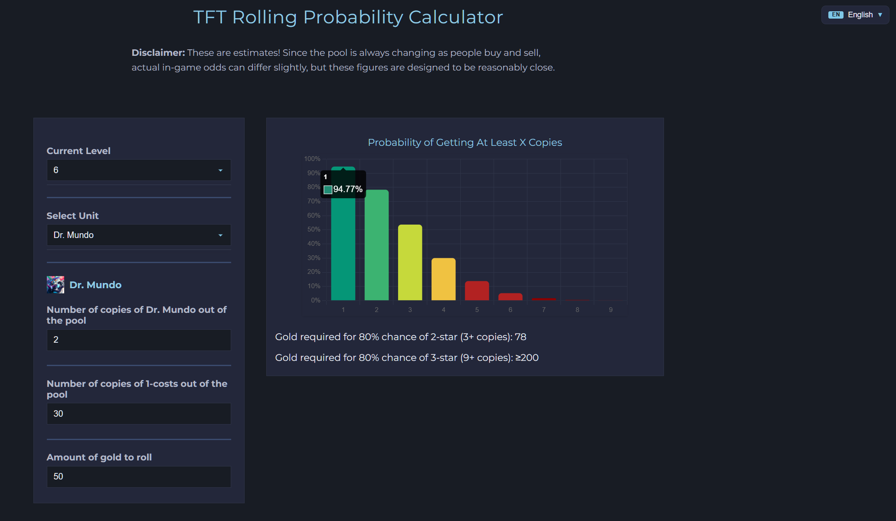

# TFT Rolling Odds Calculator

A web tool to calculate your odds of rolling any unit in Teamfight Tactics (TFT).

**Updated for Set 14**.

Use the calculator [here](https://henryvu27.github.io/TFT-Rolling-Calculator/)

## Features
- Find the chance of hitting your desired unit after any number of rolls given your current level and gold, using up-to-date shop odds and pool sizes.

## Demo


## Getting Started

### 1. Clone the Repository
```bash
# HTTPS
git clone https://github.com/yourusername/tft-rolling-calculator.git
cd tft-rolling-calculator
```

### 2. Open the App
Just open `index.html` in your browser. No build step required.


## Calculation Details

### Probability Calculation
This tool uses a Markov chain model to calculate the probability of obtaining a certain number of copies of a specific unit in TFT, given your current level, gold, and the state of the unit pool. The calculation takes into account:
- Your current level (which determines shop odds for each cost)
- The cost of the unit you are rolling for
- The number of copies of that unit and all units of that cost already out of the pool
- The amount of gold you plan to spend

#### Steps:
1. **Shop Odds**: For your level, the chance of seeing a unit of a given cost in each shop slot is determined by Riot's official shop odds table.
2. **Pool Size**: Each unit has a finite number of copies in the pool, and the pool size for each cost is set by TFT rules.
3. **Markov Chain Model**: The process of rolling is modeled as a Markov chain, where each state represents the number of copies of your target unit you have acquired. The transition matrix is built based on the probability of seeing your unit in each shop slot, considering the current pool state.
4. **Matrix Exponentiation**: The transition matrix is raised to the power corresponding to the number of shop slots you will see (5 per roll, one per 2 gold spent).
5. **Cumulative Probability**: The resulting matrix gives the probability of having at least X copies after spending your gold.

### Gold Requirement Calculation
To determine the minimum gold required for a desired probability (e.g., 80% for 2-star or 3-star):
- The tool iteratively increases the gold amount and recalculates the probability until the threshold is reached.
- For 2-star, it finds the minimum gold such that the probability of getting at least 3 copies is at least 80%.
- For 3-star, it finds the minimum gold such that the probability of getting at least 9 copies is at least 80%.

### Mathematical Details & Assumptions

#### Shop Independence
- **Shop slots are treated as independent draws with replacement.**
- This means the probability of seeing your unit in one shop slot does not affect the probability in another slot within the same roll.
- In real TFT, shop draws are technically without replacement, but the difference is negligible for practical purposes.

#### Time Complexity

**Independent Shop Approach:**
- State space: Number of copies you have (0 to 9) → ~10 states (another assumption for efficiency)
- Transition matrix: 10×10
- Time complexity per gold value: O(1) since matrix operations on 10×10 are negligible
- Total complexity for finding minimum gold (up to 200): O(200) ≈ O(1)

**Dependent Shop Approach:**
- State space: Must track entire pool state for all units of that cost
- For cost 1 units: 13 distinct champions × 30 pool size = 390 total units
- State space: All possible distributions of remaining units → O(10³ to 10⁴) states  
- Transition matrix: (state_space)² elements
- Time complexity per gold value: O(state_space³) for matrix operations
- Total complexity: O(200 × state_space³)

**Performance Comparison:**
- Independent approach: ~1,000 operations per calculation
- Dependent approach: ~10⁹ to 10¹² operations per calculation
- **Speedup: 10⁶ to 10⁹ times faster** with minimal accuracy loss

#### How the Computation Works:

**Probability of seeing your unit in a shop slot:**


- Where:
  - C = your unit's cost
  - L = your current level
  - ShopOdds(L, C) = shop odds for cost C at level L
  - U = number of copies of your unit left in the pool
  - N = total number of all units of cost C left in the pool

**Transition for one roll (5 slots):**


- Where:
    - S = state vector, where S[k] is the probability of having exactly k copies of your unit.
    - T = transition matrix, where T[i][j] is the probability of going from i to j copies in one shop slot.

**Cumulative probability of getting at least n copies (using complement rule):**


## Credits
- UI inspired by TFT stat sites.
- Built with [Chart.js](https://www.chartjs.org/) for visualization.
- Probability calculation logic derived from [wongkj12's explanation](https://github.com/wongkj12).
- [Mizerawa](https://www.reddit.com/user/Mizerawa/) for UI suggestion.
